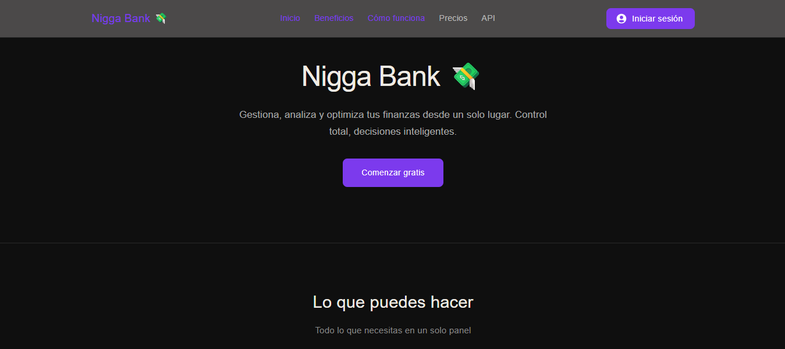

🧠 Nombre del Proyecto: Nigga Bank
📖 Descripción

La Aplicación Nigga Bank es una aplicación web completa diseñada para administrar productos, manejar la autenticación de usuarios y ofrecer una experiencia fluida e intuitiva. Está construida con tecnologías modernas como React, Vite y Axios, y cuenta con una arquitectura modular que facilita su mantenimiento y escalabilidad.

🚀 Instalación

Sigue estos pasos para ejecutar el proyecto en tu entorno local:

# Clonar el repositorio
git clone https://github.com/AnyeloBenitezzz14/Frontend-Final.git

# Entrar a la carpeta del proyecto
cd <NOMBRE_DEL_PROYECTO>

# Instalar dependencias
npm install
▶️ Ejecución

Para iniciar la aplicación en modo desarrollo:

npm run dev

Luego abre tu navegador en:

http://localhost:5173
🛠️ Tecnologías Usadas
Frontend: React, React Router DOM, MUI
Backend: Node.js, Express.js
Base de datos: (MongoDB)
Build Tool: Vite
Cliente HTTP: Axios
Autenticación: LocalStorage, AuthContext
PWA: VitePWA
🏗️ Arquitectura

El proyecto sigue una arquitectura modular organizada por funcionalidades:

src/
├── App.jsx
├── AppRoutes.jsx
├── main.jsx
├── features/
│   ├── auth/
│   │   ├── context/
│   │   │   ├── AuthContext.jsx
│   │   ├── api/
│   │   │   ├── axios.js
│   │   ├── services/
│   │   │   ├── Auth.service.js
│   ├── productos/
│   │   ├── ProductoForm.jsx
│   │   ├── ProductoList.jsx
│   │   ├── Myaccount.jsx

🔐 Variables de Entorno

Crea un archivo .env en la raíz del proyecto y agrega:

VITE_API_URL=http://localhost:3000/api

🔗 Enlaces
Repositorio Frontend: (https://github.com/AnyeloBenitezzz14/Frontend-Final.git)
Repositorio Backend: (https://github.com/AnyeloBenitezzz14/back_final.git)
Deploy front: (https://vercel.com/anyelobenitezzz14s-projects/frontend-final/53GZ6FphK6soosEK1dDivu2xRKvG)

👤 Autor

Anyelo Benítez, aprendiz sena 

📄 Licencia

Este proyecto es de uso académico.

GitHub: https://github.com/AnyeloBenitezzz14